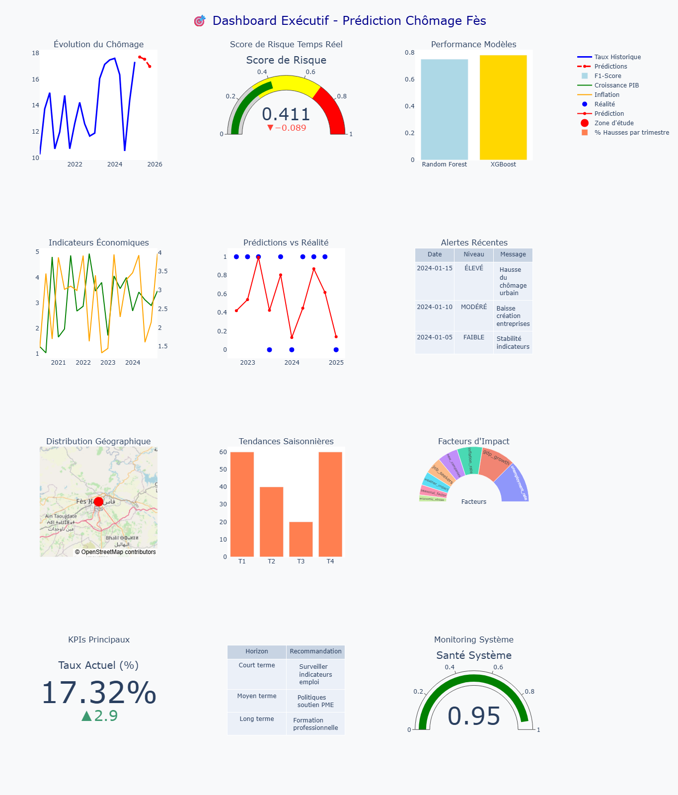

# Fes Unemployment – ML Prediction & Monitoring

Executive ML dashboard: Risk Score gauge, model performance (RF/XGB), predictions vs reality,
alerts, economic indicators, seasonality (Q1–Q4), feature impact, map, system health.

## Run (Windows / PowerShell)
python -m venv .venv
.\.venv\Scripts\Activate.ps1
pip install -r requirements.txt

## Repo layout
- notebooks/Projet_ML.ipynb
- assets/ (screenshots)
- reports/ (PDF)

**Run demo:**

python -m venv .venv
.\.venv\Scripts\Activate.ps1
pip install -r requirements.txt
streamlit run src/app/app.py

